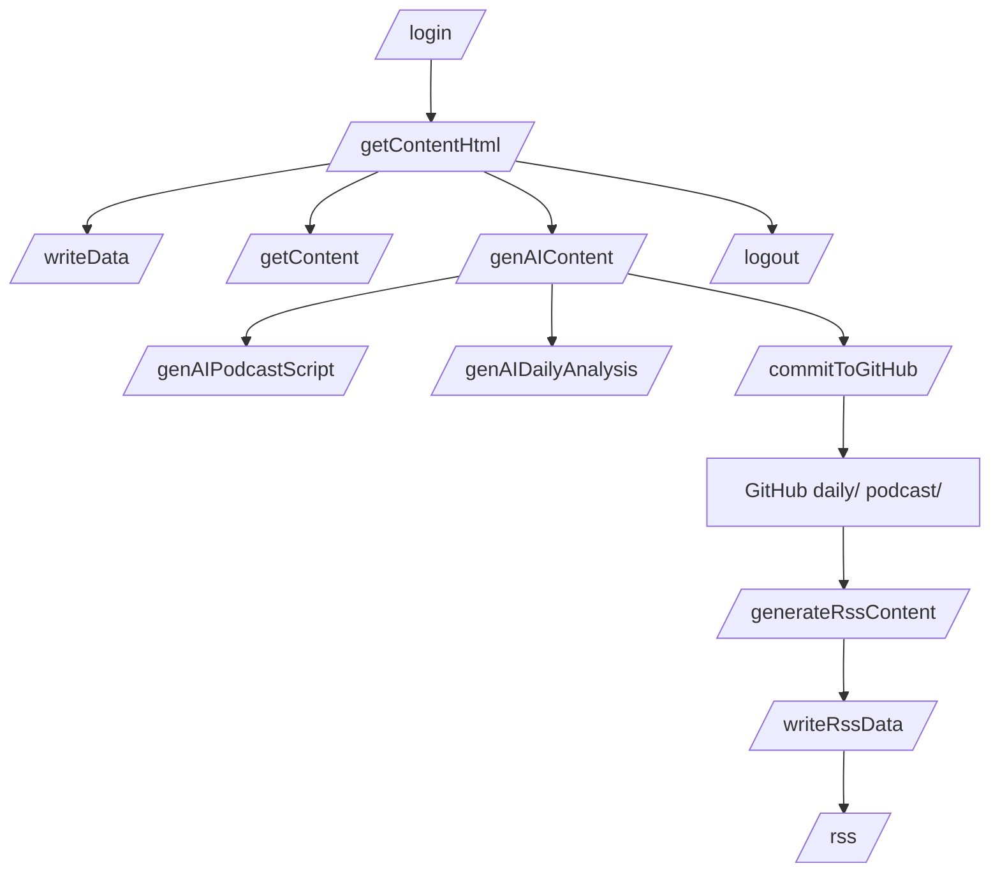
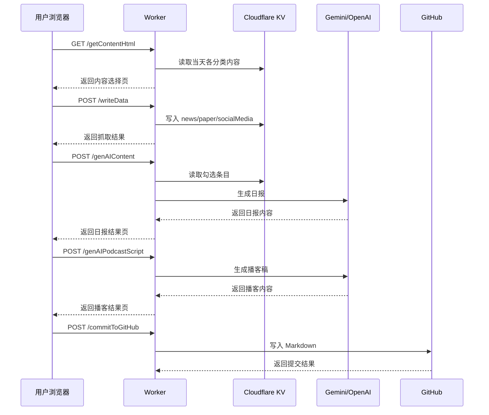

# 接口路由图

本文说明 Worker 当前暴露的核心路由、每个路由的职责、输入输出方向，以及它们之间的调用关系。适合排查请求入口、理解页面操作背后的后端流程、或准备新增接口时阅读。本文基于当前 `src/index.js` 与对应 handlers 的实际实现。

## 一句话结论

本项目的接口分为四类：`认证`、`数据抓取/查看`、`AI 生成`、`发布输出`。其中主流程是：`/getContentHtml → /writeData → /genAIContent → /commitToGitHub`。

## 总体路由关系图

## 用户操作时序图

## 路由分组说明

### 1. 认证路由

| 路由 | 方法 | 作用 | 备注 |
| --- | --- | --- | --- |
| `/login` | `GET` | 返回登录页 | 未登录用户入口 |
| `/login` | `POST` | 校验账号密码并创建 session | session 写入 KV |
| `/logout` | `GET` | 删除 session 并跳转登录页 | 清理 Cookie |

### 2. 数据抓取与查看路由

| 路由 | 方法 | 作用 | 主要读写 |
| --- | --- | --- | --- |
| `/getContentHtml` | `GET` | 返回内容勾选页面 | 从 KV 读取各分类数据 |
| `/getContent` | `GET` | 返回指定日期的 JSON 内容 | 从 KV 读取 |
| `/writeData` | `POST` | 抓取外部数据源并写入 KV | 写入 `YYYY-MM-DD-分类` |

### 3. AI 生成路由

| 路由 | 方法 | 作用 | 主要读写 |
| --- | --- | --- | --- |
| `/genAIContent` | `POST` | 根据勾选内容生成日报 | 读 KV，调用 AI |
| `/genAIPodcastScript` | `POST` | 根据日报内容生成播客稿 | 调用 AI，可读 GitHub 日报 |
| `/genAIDailyAnalysis` | `POST` | 对日报做二次分析 | 调用 AI |
| `/genAIDailyPage` | `GET` | 生成日报空白模板页 | 不依赖抓取数据 |

### 4. 发布与输出路由

| 路由 | 方法 | 作用 | 主要读写 |
| --- | --- | --- | --- |
| `/commitToGitHub` | `POST` | 将日报或播客保存到 GitHub | 写 GitHub |
| `/generateRssContent` | `GET` | 基于日报生成 RSS 摘要稿 | 读 GitHub，调 AI，写 GitHub |
| `/writeRssData` | `GET` | 将 RSS Markdown 转为 HTML 后写入 KV | 写 `YYYY-MM-DD-report` |
| `/rss` | `GET` | 输出 RSS Feed | 从 KV 聚合 report |

## 主流程拆解

### 1. 打开内容页

用户访问 `/getContentHtml` 后，Worker 会按分类从 KV 读取当天内容，并渲染为勾选页面。

### 2. 抓取数据

用户点击页面上的抓取按钮后，浏览器调用 `/writeData`，并把 `foloCookie` 放进请求体。Worker 再去请求 Folo，并把结果写回 KV。

### 3. 生成日报

用户勾选条目后提交到 `/genAIContent`。Worker 先从 KV 读取被选中的条目，再拼成 prompt，调用 AI，最后返回结果页。

### 4. 派生播客与分析

日报页可以继续触发：

- `/genAIPodcastScript`
- `/genAIDailyAnalysis`

这两个接口都属于日报内容的派生加工。

### 5. 发布到 GitHub 与 RSS

日报或播客生成后，用户可调用 `/commitToGitHub` 写入仓库。之后再通过 `/generateRssContent` 与 `/writeRssData` 把日报摘要链路接到 RSS 输出。

## 代码入口

建议按以下顺序阅读代码：

1. `src/index.js`
2. `src/handlers/getContentHtml.js`
3. `src/handlers/writeData.js`
4. `src/handlers/genAIContent.js`
5. `src/handlers/commitToGitHub.js`
6. `src/handlers/writeRssData.js`
7. `src/handlers/getRss.js`

## 边界说明

- `/getContent` 与 `/rss` 是只读接口。
- `/writeData`、`/genAIContent`、`/commitToGitHub` 属于状态推进接口。
- 除 `/login`、`/logout`、`/getContent`、`/rss`、`/writeRssData`、`/generateRssContent` 外，其余大部分页面型操作受登录态保护。
