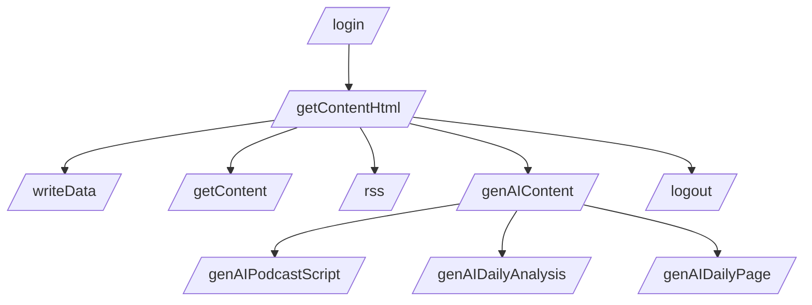
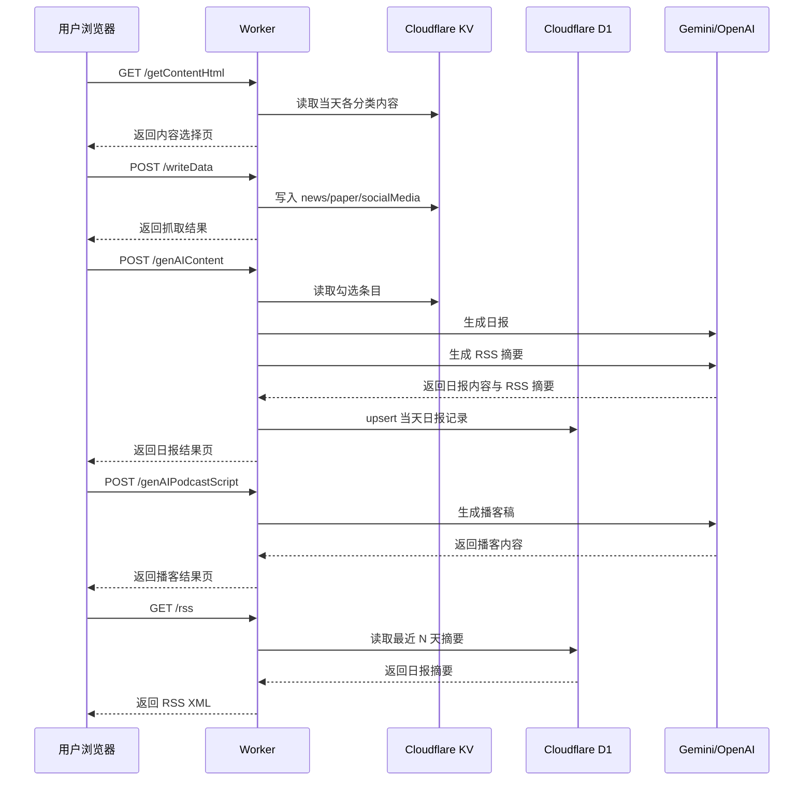

# 接口路由图

本文说明 Worker 当前暴露的核心路由、每个路由的职责，以及它们之间的关系。本文基于当前 [src/index.js](/Volumes/c/Workspace/CloudFlare-AI-Insight-Daily/src/index.js) 的实际实现。

## 一句话结论

本项目当前接口分为四类：`认证`、`数据抓取/查看`、`AI 生成`、`RSS 输出`。主流程是：`/getContentHtml → /writeData → /genAIContent`，生成成功后会自动写入 D1，并由 `/rss` 输出摘要。

## 总体路由关系图

## 用户操作时序图

## 路由分组说明

### 1. 认证路由

| 路由 | 方法 | 作用 | 备注 |
| --- | --- | --- | --- |
| `/login` | `GET` | 返回登录页 | 未登录用户入口 |
| `/login` | `POST` | 校验账号密码并创建 session | session 写入 KV |
| `/logout` | `GET` | 删除 session 并跳转登录页 | 清理 Cookie |

### 2. 数据抓取与查看路由

| 路由 | 方法 | 作用 | 主要读写 |
| --- | --- | --- | --- |
| `/getContentHtml` | `GET` | 返回内容勾选页面 | 从 KV 读取各分类数据 |
| `/getContent` | `GET` | 返回指定日期的 JSON 内容 | 从 KV 读取 |
| `/writeData` | `POST` | 抓取外部数据源并写入 KV | 写入 `YYYY-MM-DD-分类` |

### 3. AI 生成路由

| 路由 | 方法 | 作用 | 主要读写 |
| --- | --- | --- | --- |
| `/genAIContent` | `POST` | 根据勾选内容生成日报并自动发布 RSS 摘要 | 读 KV，调 AI，写 D1 |
| `/genAIPodcastScript` | `POST` | 根据日报内容生成播客稿 | 调用 AI |
| `/genAIDailyAnalysis` | `POST` | 对日报做二次分析 | 调用 AI |
| `/genAIDailyPage` | `GET` | 生成日报空白模板页 | 不依赖抓取数据 |

### 4. RSS 输出路由

| 路由 | 方法 | 作用 | 主要读写 |
| --- | --- | --- | --- |
| `/rss` | `GET` | 输出最近 N 天的 RSS Feed | 读 D1 |

## 主流程拆解

### 1. 打开内容页

用户访问 `/getContentHtml` 后，Worker 会按分类从 KV 读取当天内容，并渲染为勾选页面。

### 2. 抓取数据

用户点击页面上的抓取按钮后，浏览器调用 `/writeData`，并把 `foloCookie` 放进请求体。Worker 请求 Folo，并把结果写回 KV。

### 3. 生成日报

用户勾选条目后提交到 `/genAIContent`。Worker 先从 KV 读取被选中的条目，再拼成 prompt 调用 AI，随后把日报正文与 RSS 摘要一起写入 D1，最后返回结果页。

### 4. 派生播客与分析

日报页可以继续触发：

- `/genAIPodcastScript`
- `/genAIDailyAnalysis`

这两个接口都属于日报内容的派生加工。

### 5. RSS 输出

`/rss` 是公开只读接口。它直接从 D1 的日报记录里读取最近 N 天摘要，并拼成 RSS XML。

## 代码入口

建议按以下顺序阅读：

1. [src/index.js](/Volumes/c/Workspace/CloudFlare-AI-Insight-Daily/src/index.js)
2. [src/handlers/getContentHtml.js](/Volumes/c/Workspace/CloudFlare-AI-Insight-Daily/src/handlers/getContentHtml.js)
3. [src/handlers/writeData.js](/Volumes/c/Workspace/CloudFlare-AI-Insight-Daily/src/handlers/writeData.js)
4. [src/handlers/genAIContent.js](/Volumes/c/Workspace/CloudFlare-AI-Insight-Daily/src/handlers/genAIContent.js)
5. [src/d1.js](/Volumes/c/Workspace/CloudFlare-AI-Insight-Daily/src/d1.js)
6. [src/handlers/getRss.js](/Volumes/c/Workspace/CloudFlare-AI-Insight-Daily/src/handlers/getRss.js)

## 边界说明

- `/getContent` 与 `/rss` 是只读接口。
- `/writeData`、`/genAIContent`、`/genAIPodcastScript`、`/genAIDailyAnalysis` 属于状态推进接口。
- 除 `/login`、`/logout`、`/getContent`、`/rss` 外，其余页面型操作受登录态保护。
