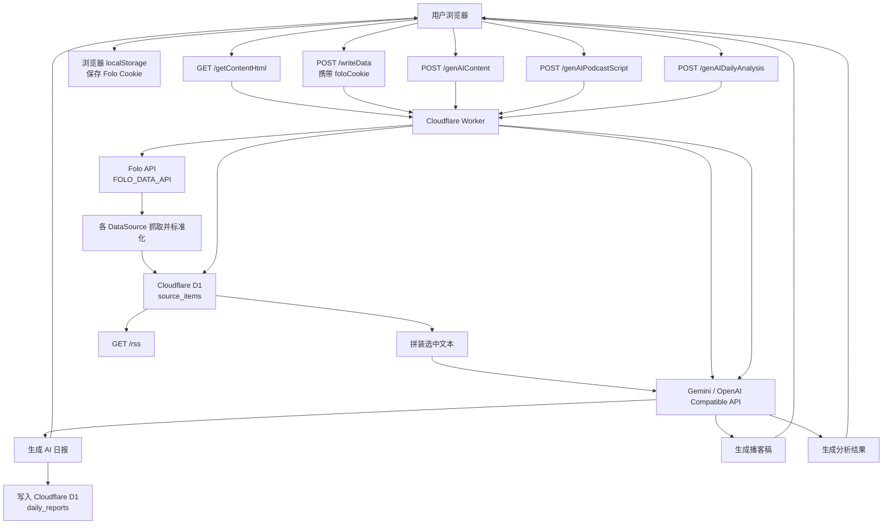
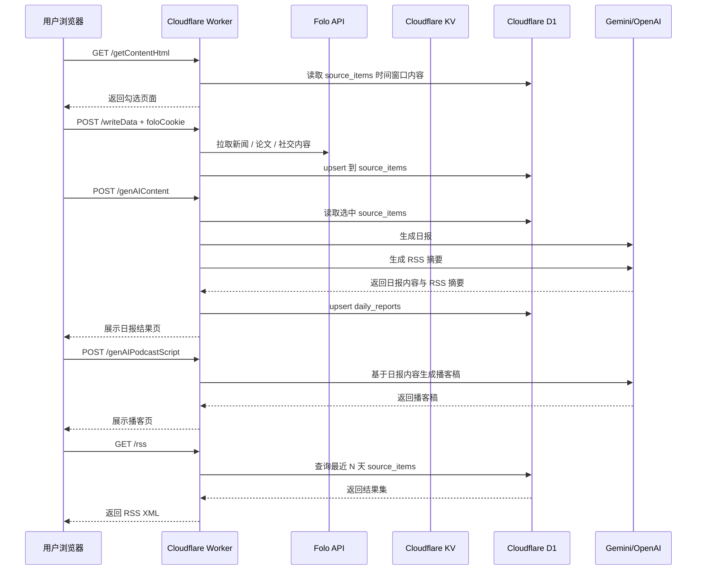

# 数据源与数据流

本文说明项目的数据从哪里来、如何进入系统，以及在 Worker 内部如何流转。本文基于当前代码实际实现，描述的是“内容数据 D1-only + KV 仅会话”的主链路。

## 一句话结论

本项目的主链路是：`浏览器 → Cloudflare Worker → Folo → Cloudflare D1(source_items) → 浏览器内容页 / RSS`，以及 `source_items → AI 生成 → Cloudflare D1(daily_reports) → 浏览器结果页`。

## 总体数据流图

## 数据来源

当前项目实际启用的数据源全部来自 Folo / Follow API：

- `news` → [newsAggregator.js](/Volumes/c/Workspace/CloudFlare-AI-Insight-Daily/src/dataSources/newsAggregator.js)
- `paper` → [papers.js](/Volumes/c/Workspace/CloudFlare-AI-Insight-Daily/src/dataSources/papers.js)
- `socialMedia` → [twitter.js](/Volumes/c/Workspace/CloudFlare-AI-Insight-Daily/src/dataSources/twitter.js)
- `socialMedia` → [reddit.js](/Volumes/c/Workspace/CloudFlare-AI-Insight-Daily/src/dataSources/reddit.js)

这些数据源主要依赖：

- `FOLO_DATA_API`
- `FOLO_FILTER_DAYS`
- `NEWS_AGGREGATOR_LIST_ID`
- `HGPAPERS_LIST_ID`
- `TWITTER_LIST_ID`
- `REDDIT_LIST_ID`

## 用户操作时序图

## 关键存储层

项目里当前有三个主要落地点。

### 1. 浏览器 `localStorage`

用于保存 `Folo Cookie`，方便用户在内容选择页重复抓取数据时复用。

### 2. Cloudflare KV

当前仅用于登录 session。

典型键名示例：

- `session:<session_id>`

### 3. Cloudflare D1

用于保存抓取与生成两类核心数据：

- `source_items`：抓取后的新闻/论文/社媒原始内容明细
- `daily_reports`：生成后的日报内容与摘要存档

`daily_reports` 里包含：

- `daily_markdown`
- `rss_markdown`
- `rss_html`
- `published_at` / `updated_at`

`/writeData`、`/getContent`、`/getContentHtml`、`/genAIContent` 的内容数据都以 `source_items` 为准；`/rss` 现在也直接读取 `source_items`，不再依赖 `daily_reports`。

## 代码中的关键入口

建议按这个顺序阅读：

1. [src/index.js](/Volumes/c/Workspace/CloudFlare-AI-Insight-Daily/src/index.js)
2. [src/handlers/writeData.js](/Volumes/c/Workspace/CloudFlare-AI-Insight-Daily/src/handlers/writeData.js)
3. [src/dataFetchers.js](/Volumes/c/Workspace/CloudFlare-AI-Insight-Daily/src/dataFetchers.js)
4. [src/dataSources/newsAggregator.js](/Volumes/c/Workspace/CloudFlare-AI-Insight-Daily/src/dataSources/newsAggregator.js)
5. [src/dataSources/papers.js](/Volumes/c/Workspace/CloudFlare-AI-Insight-Daily/src/dataSources/papers.js)
6. [src/dataSources/twitter.js](/Volumes/c/Workspace/CloudFlare-AI-Insight-Daily/src/dataSources/twitter.js)
7. [src/dataSources/reddit.js](/Volumes/c/Workspace/CloudFlare-AI-Insight-Daily/src/dataSources/reddit.js)
8. [src/handlers/genAIContent.js](/Volumes/c/Workspace/CloudFlare-AI-Insight-Daily/src/handlers/genAIContent.js)
9. [src/d1.js](/Volumes/c/Workspace/CloudFlare-AI-Insight-Daily/src/d1.js)
10. [src/handlers/getRss.js](/Volumes/c/Workspace/CloudFlare-AI-Insight-Daily/src/handlers/getRss.js)

## 补充说明

- `src/dataSources/` 目录下的文件并不会自动生效，真正启用哪些数据源由 [src/dataFetchers.js](/Volumes/c/Workspace/CloudFlare-AI-Insight-Daily/src/dataFetchers.js) 决定。
- Worker 已不再把日报或播客写入 GitHub，且内容数据不再写入 KV。

## 4. 调度与补数的数据通路

- Worker 在 `[triggers]` 中定义了 `crons = ["10 0 * * *"]`，也就是每天 **00:10 UTC / 08:10 Asia/Shanghai** 触发 `scheduled()`。
- 这个入口读取云端环境变量 `FOLO_COOKIE`（通过 `npx wrangler secret put FOLO_COOKIE` 上传），再调用 `runSourceItemIngestion` 运行当天的补数流程，唯一的输出是 D1 的 `source_items`，不会写入 `daily_reports`。
- `/backfillData` 路径复用同一条服务，每次提交 `startDate`/`endDate` 时按日逐个调用同样的 ingestion 服务，结果仍旧只落在 `source_items`。
- 手动 `/writeData` 仍然通过 UI 读取浏览器 localStorage 的 Folo Cookie，供公开页面使用。调度补数因为依赖密文，所以不会把 cookie 暴露给浏览器或 RSS 输出。
