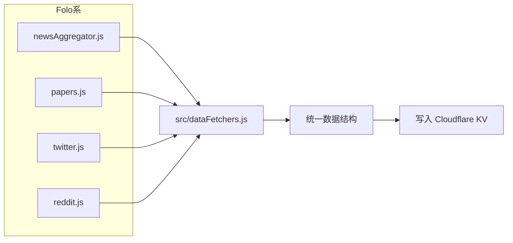
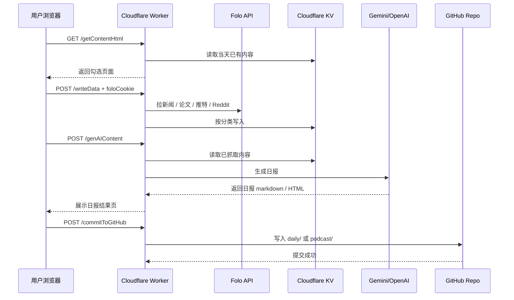

# 数据源与数据流

本文说明本项目的数据从哪里来、如何进入系统、在系统内部如何流转，以及最终如何输出。适合第一次接手项目、排查抓取链路、或准备扩展数据源的开发者阅读。本文聚焦当前代码实际实现，不展开部署细节与页面样式实现。

## 一句话结论

本项目的主链路是：`浏览器 → Cloudflare Worker → Folo → Cloudflare KV → AI 生成 → GitHub / RSS / GitHub Pages`。

## 总体数据流图

```mermaid
flowchart TD
    U[用户浏览器] --> A[GET /getContentHtml]
    A --> W[Cloudflare Worker]

    U --> B[本地保存 Folo Cookie<br/>localStorage]
    U --> C[POST /writeData<br/>携带 foloCookie]
    C --> W

    W --> D1[Folo API<br/>FOLO_DATA_API]

    D1 --> E[各 DataSource 抓取并标准化]

    E --> F[Cloudflare KV<br/>按日期+分类存储]

    U --> G[勾选内容并提交 /genAIContent]
    G --> W
    W --> F
    F --> H[拼装选中文本]
    H --> I[Gemini / OpenAI Compatible API]
    I --> J[生成 AI 日报]

    J --> U
    U --> K[POST /commitToGitHub]
    K --> W
    W --> L[GitHub Repo<br/>daily/YYYY-MM-DD.md<br/>podcast/YYYY-MM-DD.md]

    L --> M[/generateRssContent]
    M --> I
    I --> N[rss/YYYY-MM-DD.md]
    N --> O[/writeRssData]
    O --> F

    F --> P[GET /rss]
    L --> Q[GitHub Actions / Pages]
```

## 数据来源

当前项目实际启用的数据源来自 Folo / Follow API。

### 1. Folo / Follow API

这是项目的主要内容来源。当前启用的几个分类都通过 `FOLO_DATA_API` 抓取，并依赖用户在浏览器中提供的 `Folo Cookie`。

- `news` → `src/dataSources/newsAggregator.js`
- `paper` → `src/dataSources/papers.js`
- `socialMedia` → `src/dataSources/twitter.js`
- `socialMedia` → `src/dataSources/reddit.js`

这些数据源会读取以下环境变量：

- `FOLO_DATA_API`
- `FOLO_FILTER_DAYS`
- `NEWS_AGGREGATOR_LIST_ID`
- `HGPAPERS_LIST_ID`
- `TWITTER_LIST_ID`
- `REDDIT_LIST_ID`

## 数据源注册关系

当前真正参与抓取的源，由 `src/dataFetchers.js` 决定，而不是 `src/dataSources/` 目录下所有文件都会自动生效。



## 用户操作视角的时序图



## 关键存储层

项目里主要有三个落地点。

### 1. 浏览器 `localStorage`

用于保存 `Folo Cookie`，方便用户在内容选择页重复抓取数据时复用。

### 2. Cloudflare KV

用于保存：

- 按日期和分类缓存的抓取结果
- RSS report 数据
- 登录 session

典型键名示例：

- `2026-04-07-news`
- `2026-04-07-paper`
- `2026-04-07-socialMedia`
- `2026-04-07-report`
- `session:<session_id>`

### 3. GitHub 仓库

用于保存最终产物：

- `daily/YYYY-MM-DD.md`
- `podcast/YYYY-MM-DD.md`
- `rss/YYYY-MM-DD.md`

这些文件后续会被 GitHub Actions、GitHub Pages 或 RSS 工作流继续消费。

## 代码中的关键入口

如果你需要从代码继续向下追踪，建议按这个顺序阅读：

1. `src/index.js`：总路由入口
2. `src/handlers/writeData.js`：抓取并写入 KV
3. `src/dataFetchers.js`：分类与数据源注册
4. `src/dataSources/*.js`：具体抓取逻辑
5. `src/handlers/genAIContent.js`：从 KV 读取并调用 AI 生成日报
6. `src/handlers/commitToGitHub.js`：将结果写入 GitHub
7. `src/handlers/writeRssData.js`、`src/handlers/getRss.js`：RSS 生成与输出

## 补充说明

- `src/dataSources/` 目录下存在多份候选数据源文件，但并不是所有文件都会默认启用。
- 是否启用，取决于 `src/dataFetchers.js` 是否注册了该数据源。
- 因此，“目录里有文件”不等于“运行时一定参与抓取”。
