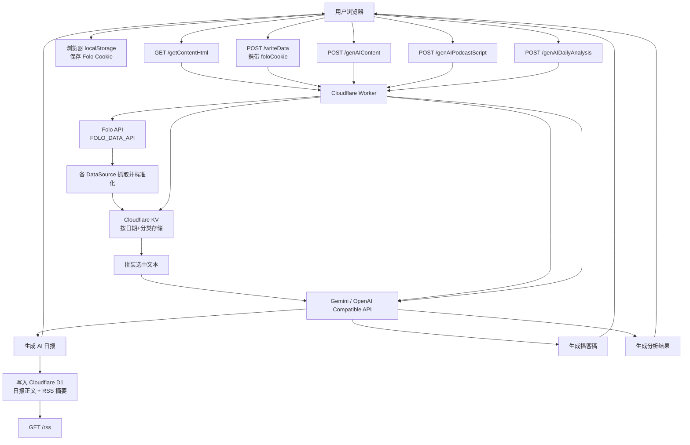
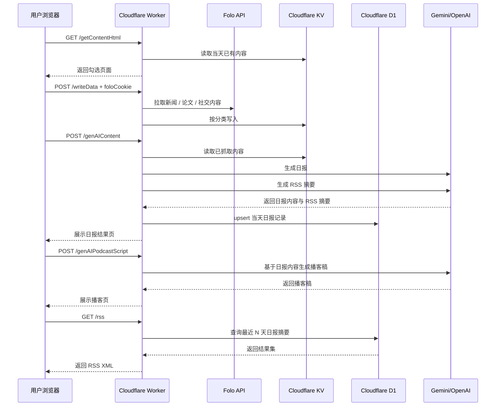

# 数据源与数据流

本文说明项目的数据从哪里来、如何进入系统，以及在 Worker 内部如何流转。本文基于当前代码实际实现，描述的是 `KV + D1` 架构下的主链路。

## 一句话结论

本项目的主链路是：`浏览器 → Cloudflare Worker → Folo → Cloudflare KV → AI 生成 → Cloudflare D1 → 浏览器结果页 / RSS`。

## 总体数据流图

## 数据来源

当前项目实际启用的数据源全部来自 Folo / Follow API：

- `news` → [newsAggregator.js](/Volumes/c/Workspace/CloudFlare-AI-Insight-Daily/src/dataSources/newsAggregator.js)
- `paper` → [papers.js](/Volumes/c/Workspace/CloudFlare-AI-Insight-Daily/src/dataSources/papers.js)
- `socialMedia` → [twitter.js](/Volumes/c/Workspace/CloudFlare-AI-Insight-Daily/src/dataSources/twitter.js)
- `socialMedia` → [reddit.js](/Volumes/c/Workspace/CloudFlare-AI-Insight-Daily/src/dataSources/reddit.js)

这些数据源主要依赖：

- `FOLO_DATA_API`
- `FOLO_FILTER_DAYS`
- `NEWS_AGGREGATOR_LIST_ID`
- `HGPAPERS_LIST_ID`
- `TWITTER_LIST_ID`
- `REDDIT_LIST_ID`

## 用户操作时序图

## 关键存储层

项目里当前有三个主要落地点。

### 1. 浏览器 `localStorage`

用于保存 `Folo Cookie`，方便用户在内容选择页重复抓取数据时复用。

### 2. Cloudflare KV

用于保存：

- 按日期和分类缓存的抓取结果
- 登录 session

典型键名示例：

- `2026-04-07-news`
- `2026-04-07-paper`
- `2026-04-07-socialMedia`
- `session:<session_id>`

### 3. Cloudflare D1

用于保存生成后的正式产物：

- `daily_markdown`
- `rss_markdown`
- `rss_html`
- `published_at` / `updated_at`

它是 `/rss` 的唯一数据来源，也是“生成即发布”的持久化落点。

## 代码中的关键入口

建议按这个顺序阅读：

1. [src/index.js](/Volumes/c/Workspace/CloudFlare-AI-Insight-Daily/src/index.js)
2. [src/handlers/writeData.js](/Volumes/c/Workspace/CloudFlare-AI-Insight-Daily/src/handlers/writeData.js)
3. [src/dataFetchers.js](/Volumes/c/Workspace/CloudFlare-AI-Insight-Daily/src/dataFetchers.js)
4. [src/dataSources/newsAggregator.js](/Volumes/c/Workspace/CloudFlare-AI-Insight-Daily/src/dataSources/newsAggregator.js)
5. [src/dataSources/papers.js](/Volumes/c/Workspace/CloudFlare-AI-Insight-Daily/src/dataSources/papers.js)
6. [src/dataSources/twitter.js](/Volumes/c/Workspace/CloudFlare-AI-Insight-Daily/src/dataSources/twitter.js)
7. [src/dataSources/reddit.js](/Volumes/c/Workspace/CloudFlare-AI-Insight-Daily/src/dataSources/reddit.js)
8. [src/handlers/genAIContent.js](/Volumes/c/Workspace/CloudFlare-AI-Insight-Daily/src/handlers/genAIContent.js)
9. [src/d1.js](/Volumes/c/Workspace/CloudFlare-AI-Insight-Daily/src/d1.js)
10. [src/handlers/getRss.js](/Volumes/c/Workspace/CloudFlare-AI-Insight-Daily/src/handlers/getRss.js)

## 补充说明

- `src/dataSources/` 目录下的文件并不会自动生效，真正启用哪些数据源由 [src/dataFetchers.js](/Volumes/c/Workspace/CloudFlare-AI-Insight-Daily/src/dataFetchers.js) 决定。
- Worker 已不再把日报或播客写入 GitHub，但会把日报正文与 RSS 摘要写入 D1。
