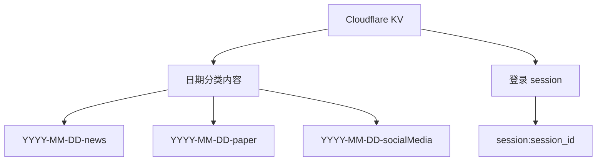
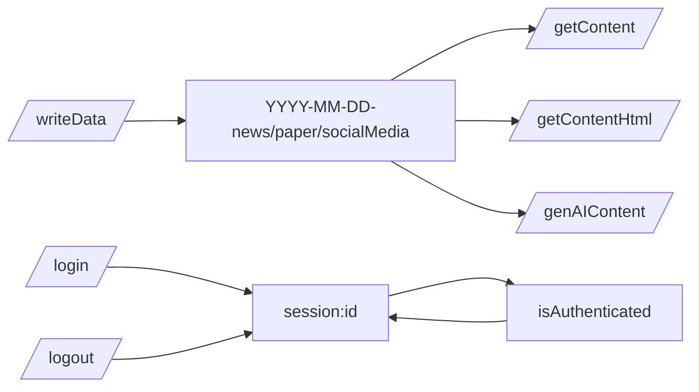

# KV 键结构说明

本文说明项目当前写入 Cloudflare KV 的键名规则、存储内容、写入时机与读取时机。日报正文与 RSS 摘要现已写入 D1，不再保存在 KV。

## 一句话结论

当前 KV 主要承载两类数据：`按日期分类的抓取结果` 与 `登录 session`。生成后的正式产物已迁移到 D1。

## KV 键分类图



## 键名总表

| Key 模式 | 示例 | 值类型 | 写入位置 | 读取位置 |
| --- | --- | --- | --- | --- |
| `YYYY-MM-DD-news` | `2026-04-07-news` | JSON 数组 | `/writeData` | `/getContent` `/getContentHtml` `/genAIContent` |
| `YYYY-MM-DD-paper` | `2026-04-07-paper` | JSON 数组 | `/writeData` | `/getContent` `/getContentHtml` `/genAIContent` |
| `YYYY-MM-DD-socialMedia` | `2026-04-07-socialMedia` | JSON 数组 | `/writeData` | `/getContent` `/getContentHtml` `/genAIContent` |
| `session:<id>` | `session:abc123` | JSON 字符串 | `/login` | 登录校验、续期、登出 |

## 1. 按日期分类的抓取结果

这是项目最核心的一组 key。它们承接外部数据源抓取结果，并作为日报生成阶段的输入。

### 键名规则

格式为：

```text
YYYY-MM-DD-分类名
```

当前分类名来自 [src/dataFetchers.js](/Volumes/c/Workspace/CloudFlare-AI-Insight-Daily/src/dataFetchers.js)：

- `news`
- `paper`
- `socialMedia`

### 写入时机

由 `/writeData` 写入：

- 全量抓取：一次写入全部分类
- 按分类抓取：只写某一个分类

### 读取时机

- `/getContent`
- `/getContentHtml`
- `/genAIContent`

### 值结构

值是一个 JSON 数组，每个元素是统一格式的数据对象，通常包含：

- `id`
- `type`
- `url`
- `title`
- `description`
- `published_date`
- `authors`
- `source`
- `details`

## 2. 登录 session

这组 key 用于登录态维护。

### 键名规则

格式为：

```text
session:<session_id>
```

### 写入与删除时机

- `/login` 登录成功后写入
- `isAuthenticated()` 校验成功后会续期并重写
- `/logout` 删除该 key

### 值结构

当前保存的是字符串语义的 session 状态，实际以 JSON 字符串形式存储。

示意：

```json
"valid"
```

## TTL 说明

### 默认 TTL

[src/kv.js](/Volumes/c/Workspace/CloudFlare-AI-Insight-Daily/src/kv.js) 中默认 TTL 是 7 天：

```text
86400 * 7
```

因此抓取结果默认保留 7 天。

### Session TTL

[src/auth.js](/Volumes/c/Workspace/CloudFlare-AI-Insight-Daily/src/auth.js) 中 session TTL 是 1 小时：

```text
60 * 60
```

并且每次通过认证后会续期。

## 写入与读取关系图



## 使用建议

- 排查“页面空白”时，先看当天分类 key 是否写入。
- 排查“RSS 没内容”时，检查 D1 的 `daily_reports` 表，而不是 KV。
- 排查“登录失效”时，检查 `session:` key 是否被成功续期或被提前清理。

## 代码入口

建议按以下顺序阅读：

1. [src/kv.js](/Volumes/c/Workspace/CloudFlare-AI-Insight-Daily/src/kv.js)
2. [src/handlers/writeData.js](/Volumes/c/Workspace/CloudFlare-AI-Insight-Daily/src/handlers/writeData.js)
3. [src/handlers/getContent.js](/Volumes/c/Workspace/CloudFlare-AI-Insight-Daily/src/handlers/getContent.js)
4. [src/handlers/getContentHtml.js](/Volumes/c/Workspace/CloudFlare-AI-Insight-Daily/src/handlers/getContentHtml.js)
5. [src/handlers/genAIContent.js](/Volumes/c/Workspace/CloudFlare-AI-Insight-Daily/src/handlers/genAIContent.js)
6. [src/auth.js](/Volumes/c/Workspace/CloudFlare-AI-Insight-Daily/src/auth.js)
