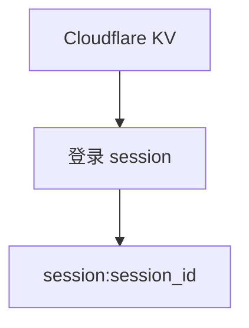
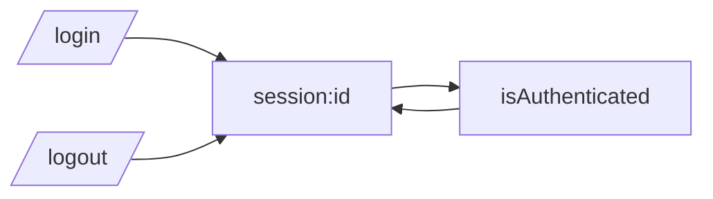

# KV 键结构说明

本文说明项目当前写入 Cloudflare KV 的键名规则、存储内容、写入时机与读取时机。当前版本中，内容数据已迁移到 D1 的 `source_items`，KV 仅用于登录 session。

## 一句话结论

当前 KV 只承载登录 session：`session:<id>`。

## KV 键分类图



## 键名总表

| Key 模式 | 示例 | 值类型 | 写入位置 | 读取位置 |
| --- | --- | --- | --- | --- |
| `session:<id>` | `session:abc123` | JSON 字符串 | `/login` | 登录校验、续期、登出 |

## 1. 登录 session

这组 key 用于登录态维护。

### 键名规则

格式为：

```text
session:<session_id>
```

### 写入与删除时机

- `/login` 登录成功后写入
- `isAuthenticated()` 校验成功后会续期并重写
- `/logout` 删除该 key

### 值结构

当前保存的是字符串语义的 session 状态，实际以 JSON 字符串形式存储。

示意：

```json
"valid"
```

## TTL 说明

### Session TTL

[src/auth.js](/Volumes/c/Workspace/CloudFlare-AI-Insight-Daily/src/auth.js) 中 session TTL 是 1 小时：

```text
60 * 60
```

并且每次通过认证后会续期。

## 写入与读取关系图



## 与 D1 的边界

- 内容抓取与选择数据由 D1 `source_items` 承载（`/writeData`、`/getContent`、`/getContentHtml`、`/genAIContent`）。
- 生成后的日报与 RSS 摘要由 D1 `daily_reports` 承载（`/genAIContent`、`/rss`）。
- KV 不再保存 `YYYY-MM-DD-news`、`YYYY-MM-DD-paper`、`YYYY-MM-DD-socialMedia` 这类内容键。

## 使用建议

- 排查“登录失效”时，检查 `session:` key 是否被成功续期或被提前清理。
- 排查“内容为空”时，优先检查 D1 的 `source_items` 查询窗口和写入情况，而不是 KV。
- 排查“RSS 没内容”时，检查 D1 的 `daily_reports` 表。

## 代码入口

建议按以下顺序阅读：

1. [src/kv.js](/Volumes/c/Workspace/CloudFlare-AI-Insight-Daily/src/kv.js)
2. [src/auth.js](/Volumes/c/Workspace/CloudFlare-AI-Insight-Daily/src/auth.js)
3. [src/handlers/writeData.js](/Volumes/c/Workspace/CloudFlare-AI-Insight-Daily/src/handlers/writeData.js)
4. [src/handlers/getContent.js](/Volumes/c/Workspace/CloudFlare-AI-Insight-Daily/src/handlers/getContent.js)
5. [src/handlers/getContentHtml.js](/Volumes/c/Workspace/CloudFlare-AI-Insight-Daily/src/handlers/getContentHtml.js)
6. [src/handlers/genAIContent.js](/Volumes/c/Workspace/CloudFlare-AI-Insight-Daily/src/handlers/genAIContent.js)
7. [src/d1.js](/Volumes/c/Workspace/CloudFlare-AI-Insight-Daily/src/d1.js)
